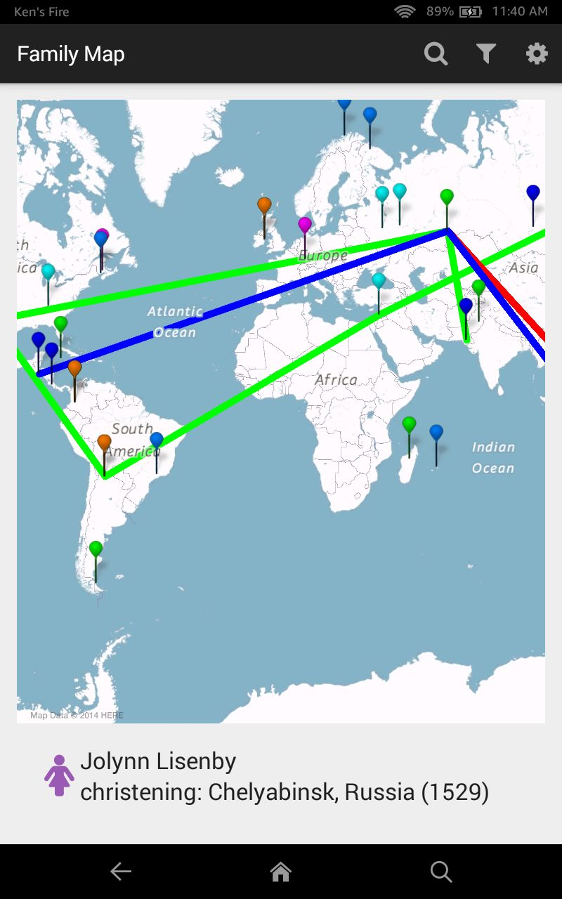

# FamilyMap Server

**Family Map** is an app that displays your family history across the globe! After inputting your family tree, you can open the map and see where each member of your family was born, died, was married, or had other major life events.

This portion contains the backend server code, which uses Java and SQL to compile the information needed for users' requests, and returns it to the client application. The client-side information is given in FamilyMapClient, also on my github.
